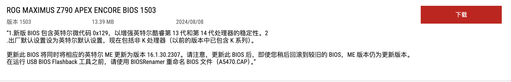

维护内容：

1.更新BIOS版本：ROG MAXIMUS Z790 APEX ENCORE BIOS 1503

2.内存设置XPM超频，频率恢复到硬件当有的水平：6600Mhz

3.取消CPU超频，当前CPUZ单核930至935分左右，CInebench r23单核2100至2200分左右

4.安装远程服务器电源管理卡，可以远程软开关机，强制开关机，微信小程序可控

<!-- truncate -->
